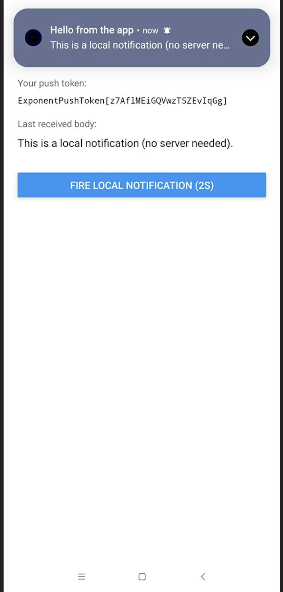

# PushDemo 

A React Native Expo application demonstrating push notification implementation across iOS and Android platforms.

---

## Overview

PushDemo is a practical implementation of push notifications using Expo's notification system. The app handles device registration, permission management, and notification handling for both foreground and background states.

### Key Features
- Cross-platform push notification support (iOS & Android)
- Device permission management
- Expo push token generation
- Android notification channel configuration
- Foreground notification handling
- TypeScript support

---

## Screenshots

### Push Notification Demo


---

## Tech Stack

| Technology | Version |
|-----------|---------|
| Expo | ~54.0.33 |
| React Native | 0.81.5 |
| React | 19.1.0 |
| TypeScript | ~5.9.2 |

### Key Dependencies
- `expo-notifications` - Push notification functionality
- `expo-device` - Device information
- `expo-constants` - App constants
- `expo-status-bar` - Status bar management

---

## Getting Started

### Prerequisites
- Node.js (v18 or higher)
- Expo CLI
- Physical device (required for testing push notifications)

### Installation

```bash
# Clone the repository
git clone https://github.com/02240365/SWE201_Practical4_02240365.git
cd PushDemo

# Install dependencies
npm install

# Start the development server
npm start
```

### Running on Device

```bash
# For iOS
npm run ios

# For Android
npm run android

# For Web
npm run web
```

---

## Project Structure

```
PushDemo/
├── App.tsx                 # Main application component with notification setup
├── index.ts                # Entry point
├── app.json                # Expo configuration
├── package.json            # Dependencies and scripts
├── tsconfig.json           # TypeScript configuration
├── android/                # Android native files
│   ├── app/
│   └── gradle/
└── assets/                 # App icons and images
```

---

## Implementation Details

### 1. Global Notification Handler
Controls how notifications behave when the app is in the **foreground**:
- Shows alert messages
- Displays banner notifications
- Enables sound playback
- Manages badge updates

### 2. Permission Request Flow
- Checks if running on a physical device
- Requests user permissions for notifications
- Creates Android notification channel
- Generates and stores Expo push token

### 3. Android Configuration
Notification channel setup with:
- MAX importance level
- Custom vibration pattern
- Light color indicator

---

## Configuration

### `app.json` Settings

```json
{
  "plugins": [
    [
      "expo-notifications",
      {
        "icon": "./assets/notification-icon.png",
        "color": "#ffffff",
        "defaultChannel": "default"
      }
    ]
  ]
}
```

## Usage

### Get Notification Token

The app automatically requests permissions and generates a token on launch. This token is needed to send push notifications from your backend.

### Sending Test Notifications

Use the Expo push notification tool or your backend service to send notifications using the device token.

---

## Troubleshooting

| Issue | Solution |
|-------|----------|
| Notifications not appearing | Ensure notifications are enabled in device settings |
| Permission denied | Check app permissions in device settings |
| Token not generated | Use a physical device (simulator has limitations) |
| Android notifications not showing | Verify notification channel is created |

---

## Best Practices

- Always use a physical device for testing push notifications
- Request permissions at an appropriate time in user flow
- Handle both foreground and background notification states
- Test on both iOS and Android devices
- Keep Expo SDK updated for latest features

---

## Resources

- [Expo Notifications Documentation](https://docs.expo.dev/versions/v54.0.0/)
- [React Native Docs](https://reactnative.dev/)
- [Expo Push Notifications Guide](https://docs.expo.dev/push-notifications/overview/)


